# Ensuring Compatibility with Ethereum’s Pectra Upgrade

## Table of Contents

- [Simple Summary](#simple-summary)
- [Abstract](#abstract)
- [Motivation](#motivation)
- [Specification](#specification)
  - [1. Updates to Accounting, Validator Exit Bus, and CSM Oracles](#1-updates-to-accounting-validator-exit-bus-and-csm-oracles)
    - [Overview](#overview)
    - [Rationale](#rationale)
      - [Transient Balance](#transient-balance)
      - [Deposit Mechanism Migration](#deposit-mechanism-migration)
      - [Withdrawals Processing Time Prediction](#withdrawals-processing-time-prediction)
      - [Bunker Mode and The Correlated Penalty](#bunker-mode-and-the-correlated-penalty)
      - [Identifying Stuck Validators](#identifying-stuck-validators)
    - [Technical Specification](#technical-specification)
      - [Electra Spec Activation](#electra-spec-activation)
      - [Deposit Mechanism Migration](#deposit-mechanism-migration-1)
      - [Withdrawals Processing Time Prediction](#withdrawals-processing-time-prediction-1)
      - [The Correlated Penalty](#the-correlated-penalty)
      - [Churn Limit](#churn-limit)
      - [Attestation Containers Changes](#attestation-containers-changes)
      - [Constants and Helper Functions](#constants-and-helper-functions)
  - [2. Updates to Oracle Report Sanity Checker Parameters](#2-updates-to-oracle-report-sanity-checker-parameters)
    - [Overview](#overview-1)
    - [Rationale](#rationale-1)
    - [Technical Specification](#technical-specification-1)
  - [3. Updates to CS Verifier Contract](#3-updates-to-cs-verifier-contract)
    - [Overview](#overview-2)
    - [Rationale](#rationale-2)
      - [Remove Initial Slashing Penalty Report](#remove-initial-slashing-penalty-report)
      - [Update gIndexes](#update-gindexes)
    - [Technical Specification](#technical-specification-2)
      - [Remove Initial Slashing Penalty Report](#remove-initial-slashing-penalty-report-1)
      - [Update gIndexes](#update-gindexes-1)
- [Links](#links)
- [Copyright](#copyright)

## Simple Summary

This proposal outlines changes to the Lido protocol to ensure continuous operation with Ethereum’s upcoming Pectra hardfork, focusing exclusively on compatibility rather than integrating any new features introduced by Pectra.

## Abstract

For the off-chain components of the Accounting, Validator Exit Bus, and CSM oracles, it is proposed to:

- Implement the switch to the new report collection algorithm at the time of the hardfork activation;
- Account for Eth1 bridge deposits in the `pending_deposits` queue at the time of the hardfork activation;
- Update the sweep cycle length calculation algorithm in the Validator Exit Bus Oracle;
- Update the calculation of the correlated penalty size in the Accounting Oracle;
- Update the churn limit calculation in the Validator Exit Bus Oracle;
- Support the new format of attestation containers in the CSM Oracle;
- Update constants and helper functions in the oracles.

For the Oracle Report Sanity Checker, it is proposed to update the following parameters:

- `exitedValidatorsPerDayLimit`: from `9000` to `3600`;
- `appearedValidatorsPerDayLimit`: from `43200` to `1800`;
- `initialSlashingAmountPWei`: from `1000` to `8`.

For the CS Verifier contract, it is proposed to:

- Remove the processing of slashing proofs;
- Redeploy the contract with the Electra activation slot and two sets of gIndexes for Deneb and Electra.

## Motivation

The Pectra upgrade introduces changes to the Ethereum protocol specifications that directly impact components of the Lido protocol. Specifically, these changes affect the algorithms of the Accounting, Validator Exit Bus, and CSM oracles, the limits in the Oracle Report Sanity Checker contract, the slashing penalty, and the gIndexes in the CS Verifier contract. To ensure the Lido protocol continues to operate accurately and reliably, the affected oracle algorithms, Oracle Report Sanity Checker limits, and the CS Verifier must be reviewed and updated in accordance with the new Ethereum protocol specifications.

## Specification

### 1. Updates to Accounting, Validator Exit Bus, and CSM Oracles

#### Overview

New versions of the off-chain oracles are proposed, featuring updated algorithms for the Accounting, Validator Exit Bus, and CSM oracles to ensure compatibility with changes introduced by the Pectra hardfork. To minimize disruption, the implementation will include both the current and the updated algorithms, with the latter activated after the Pectra hardfork goes live on the network.

The oracle contracts will use an updated [consensus version](https://docs.lido.fi/contracts/accounting-oracle#getconsensusversion) to signal off-chain oracle instances which algorithm to apply for report collection. It is proposed that the updated algorithm be activated via an on-chain vote prior to the hardfork. This vote will increment the consensus version parameter. Once the Pectra hardfork is activated on the network, the updated algorithm will automatically take effect and be used for report building.

#### Rationale

Most changes introduced by Pectra directly rely on the consensus layer specification or replicate certain methods from it. These updates are straightforward and strictly adhere to the Ethereum specification. Other changes are more subtle and are explained in this section.

##### Transient Balance

The changes announced in [EIP-6110](https://eips.ethereum.org/EIPS/eip-6110) and [EIP-7251](https://eips.ethereum.org/EIPS/eip-7251) affect the duration ETH remains in a transient state within the Lido protocol. Transient balance refers to the balance of validators that have been deposited but not yet added to the registry on the consensus layer. The transient balance is calculated as `(DEPOSITED_VALIDATORS - CL_VALIDATORS) * DEPOSIT_SIZE`, where:

- `DEPOSITED_VALIDATORS` is the total number of validators deposited in the Lido protocol,
- `CL_VALIDATORS` is the total number of validators in the registry as reported by the Accounting Oracle,
- `DEPOSIT_SIZE` is the amount of ETH deposited by each validator.

_Before Pectra_, deposited validators are added to the registry on the consensus layer in [~14.8 hours](https://github.com/ethereum/consensus-specs/blob/dev/specs/phase0/validator.md#process-deposit) (`ETH1_FOLLOW_DISTANCE` + `EPOCHS_PER_ETH1_VOTING_PERIOD`).

```mermaid
---
config:
  gantt:
    useWidth: 600
    useMaxWidth: false
---
gantt
  title Before Pectra: Eth1 bridge deposit processing
  dateFormat HH:mm
  axisFormat %
  todayMarker off
  tickInterval 12month

  section EL
  Deposit transaction             : milestone, m1, 00:00, 0m
  ETH1_FOLLOW_DISTANCE            : 8h

  section CL
  EPOCHS_PER_ETH1_VOTING_PERIOD   : 6.8h
  Validator added to the registry : milestone, m2
```



_After Pectra_, validators are added to the registry after passing through the `pending_deposits` queue and the finalization of the block with the deposit transaction.

```mermaid
---
config:
  gantt:
    useWidth: 600
    useMaxWidth: false
---
gantt
  title After Pectra: Deposit request processing
  dateFormat HH:mm
  axisFormat %
  todayMarker off
  tickInterval 12month

  section EL
  Deposit transaction             : milestone, m1, 00:00, 0m

  section CL
  Slot finalization               : after m1, 13m
  Pending deposit queue           : pd, after m1, 4h
  Validator added to the registry : milestone, m2
```



The new deposit processing mechanism changes the time ETH remains in a transient state within the Lido protocol from almost constant to dynamic, depending on the volume of ETH in the `pending_deposits` queue.

_It is proposed to keep the logic of reporting the balance on the consensus layer unchanged, except for the migration period, which is considered in the next section_.

##### Deposit Mechanism Migration

[EIP-6110](https://eips.ethereum.org/EIPS/eip-6110) introduces a new mechanism for processing deposits and [EIP-7251](https://eips.ethereum.org/EIPS/eip-7251) introduces a new weight-based queue `pending_deposits` for the new deposit mechanism.

During the Electra fork activation, the balance of validators that have not yet been activated (`validator.activation_epoch == FAR_FUTURE_EPOCH`) will be [moved to the `pending_deposits`](https://github.com/ethereum/consensus-specs/blob/dev/specs/electra/fork.md#upgrading-the-state). Deposits made before the fork activation but not yet processed will be handled by the former Eth1 bridge deposits mechanism but with [modified logic](https://github.com/ethereum/consensus-specs/blob/dev/specs/electra/beacon-chain.md#modified-apply_deposit) – validators will be added to the registry with a balance of 0, and the deposits themselves will be placed to the `pending_deposits`.

This behavior affects the logic of accounting for the total pooled ether in the Lido protocol. The Accounting Oracle reports the total number of validators in any status on the consensus layer and their total balance. Validators that are deposited but not yet registered on the consensus layer are accounted for as transient `DEPOSITED_VALIDATORS - CL_VALIDATORS` with a constant value of `DEPOSIT_SIZE` ETH. Validators present in the registry with a zero balance but with deposits in `pending_deposits` will not be considered transient and will be included in the total number of validators on the consensus layer, with their balance counted as zero. This situation will be perceived by the protocol as a loss, as the ETH in `pending_deposits` will not be accounted for.

```mermaid
---
config:
  gantt:
    useWidth: 600
    useMaxWidth: false
---
gantt
  title Affected deposits
  dateFormat HH:mm
  axisFormat %
  todayMarker off
  tickInterval 12month

  Electra activation      : milestone, 14:48, 0m
  ETH1_FOLLOW_DISTANCE + EPOCHS_PER_ETH1_VOTING_PERIOD : 00:00, 14.8h
  First affected deposit  : milestone, 00:00, 0m
```



To address this issue, _it is proposed to account for Eth1 bridge deposits in the `pending_deposits` queue for non-activated validators with a zero balance in the total balance of Lido validators on the consensus layer_. It is expected that validators meeting these conditions can only appear after the Electra fork activation during the migration period to deposit requests. In the next release of the Accounting Oracle, this additional condition should be removed.

##### Withdrawals Processing Time Prediction

[EIP-7251](https://eips.ethereum.org/EIPS/eip-7251) introduces changes to the [withdrawals processing mechanism](https://github.com/ethereum/consensus-specs/blob/dev/specs/electra/beacon-chain.md#modified-get_expected_withdrawals) in the Ethereum protocol. The changes affect the algorithm in the Validator Exit Bus Oracle for predicting the time required for a validator to become fully withdrawn after reaching the `withdrawable_epoch`.

_It is proposed to update the algorithm for predicting the time required for a validator to become fully withdrawn, reflecting the processing of `pending_partial_withdrawals` added in [EIP-7251](https://eips.ethereum.org/EIPS/eip-7251)_.

The following assumptions are made:

- The time required for a validator to become fully withdrawn after reaching the `withdrawable_epoch` is, on average, equal to half the time required to process all validators in a sweep cycle;
- Blocks are not missed, so each slot has a block with a payload;
- All `pending_partial_withdrawals` have reached the `withdrawable_epoch` and do not have any processing delays;
- All `pending_partial_withdrawals` are executed before full and partial withdrawals, and the result is immediately reflected in the validators' balances;
- The limit `MAX_VALIDATORS_PER_WITHDRAWALS_SWEEP` is never reached.

These assumptions simplify the implementation and ensure that the algorithm remains efficient and straightforward. Although these assumptions may not always hold true in every scenario, they provide a reasonable approximation for the average case.

##### Bunker Mode and The Correlated Penalty

[EIP-7251](https://eips.ethereum.org/EIPS/eip-7251) introduces changes in the [initial slashing penalty](https://github.com/ethereum/consensus-specs/blob/dev/specs/electra/beacon-chain.md#rewards-and-penalties) and in the [correlated penalty computation](https://github.com/ethereum/consensus-specs/pull/3882). These changes affect the activation conditions of [Bunker mode](https://docs.lido.fi/guides/oracle-spec/accounting-oracle#bunker-mode), a special mode in the [Withdrawals Queue](https://docs.lido.fi/guides/lido-tokens-integration-guide#withdrawals-unsteth) that provides protection for users who are withdrawing during rare but potentially adverse network conditions, such as mass slashing.

- It is proposed to update the calculation of the correlated penalty in accordance with the changes in the [`process_slashings`](https://github.com/ethereum/consensus-specs/blob/dev/specs/electra/beacon-chain.md#modified-process_slashings) method in the Ethereum specification. The new calculation algorithm will be activated for reports with a reference slot >= the hardfork activation slot.
- It is proposed to leave the Bunker mode activation checks and configurable parameters unchanged. [The analytical research](https://docs.google.com/document/d/10NrRHPOXEjP1gZ78XQ6MP09k57SljmsdbAqkZSKAAuw/edit?usp=sharing) shows that although the network conditions triggering Bunker mode activation change significantly, the principle of checks based on measuring the rebase on the consensus layer remains relevant.

##### Identifying Stuck Validators

[EIP-7251](https://eips.ethereum.org/EIPS/eip-7251) introduces a new condition to the [voluntary exit processing](https://github.com/ethereum/consensus-specs/blob/dev/specs/electra/beacon-chain.md#modified-process_voluntary_exit) requests. A validator’s voluntary exit request will be rejected as long as there are pending partial withdrawals for that validator in the queue.

This new condition affects the current algorithm for identifying stuck validators. The Accounting Oracle collects data on validators that have been requested for exit but have not exited within the allocated time and reports them as stuck. The staking module, in turn, penalizes node operators who have stuck validators for not adhering to the exit policy.

With a sufficiently large queue, the presence of pending partial withdrawals for a validator requested for exit may prevent them from exiting on time, which could lead to the penalty of the node operator.

Nevertheless, _it is proposed not to change the algorithm for identifying stuck validators_. Partial withdrawals from a validator’s balance can only be initiated from the execution address of the withdrawal credentials and only for validators with [new withdrawal credentials prefix `0x02`](https://github.com/ethereum/consensus-specs/blob/dev/specs/electra/beacon-chain.md#withdrawal-prefixes). The proposed protocol update does not include an update to the withdrawal vault contract to support partial withdrawals and does not include support for the required withdrawal credentials prefix `0x02`.

This condition should be considered in future protocol releases that include support for the new withdrawal credentials type and partial withdrawals.

#### Technical Specification

This section describes the technical details of implementing changes in the oracles. Some changes straightforward and strictly adhere to the Ethereum specification, while the rationale for other chosen solutions is provided in the section above.

##### Electra Spec Activation

It is proposed that the new consensus version bumped in the oracle contracts will signal the off-chain oracle instances to switch to the new algorithm considering the Electra spec activation. Before the hardfork, the algorithm collects the report using the former methods; after the hardfork, it uses the new methods. The algorithm should check the `ELECTRA_FORK_EPOCH` constant from a consensus layer node [`/eth/v1/config/spec`](https://ethereum.github.io/beacon-APIs/#/Config/getSpec) and switch logic if an oracle report reference slot is reached this epoch.

```python
def is_electra_activated(ref_slot: Slot) -> bool:
  """
  Return True if the Electra fork is activated.
  """
  return ref_slot >= compute_start_slot_at_epoch(ELECTRA_FORK_EPOCH)
```

##### Deposit Mechanism Migration

It is proposed to change the logic of Accounting Oracle to account for Eth1 bridge deposits in the `pending_deposits` queue for non-activated validators with a zero balance in the total balance of Lido validators on the consensus layer.

```python
def get_lido_cl_total_balance(state: BeaconState, lido_validators: List[Validator]) -> Gwei:
  """
  Return the total balance of validators in the Lido protocol.
  """
  total_balance = Gwei(0)

  for validator in lido_validators:
    total_balance += validator.balance

    if (
      # An non activated validator with a zero balance can occur in two cases:
      # 1. A validator whose balance was moved to the pending_deposits queue during the Electra hardfork activation
      #    https://github.com/ethereum/consensus-specs/blob/dev/specs/electra/fork.md#upgrading-the-state
      # 2. A validator whose deposit was processed after the Electra hardfork activation through the former Eth1 bridge
      #    https://github.com/ethereum/consensus-specs/blob/dev/specs/electra/beacon-chain.md#modified-apply_deposit

      validator.effective_balance == 0 and
      validator.activation_epoch == FAR_FUTURE_EPOCH
    ):
      # Pending deposits may contain:
      # - Deposit requests:      https://github.com/ethereum/consensus-specs/blob/dev/specs/electra/beacon-chain.md#deposit-requests
      # - Eth1 bridge deposits:  https://github.com/ethereum/consensus-specs/blob/dev/specs/electra/beacon-chain.md#modified-apply_deposit
      # - Excess active balance: https://github.com/ethereum/consensus-specs/blob/dev/specs/electra/beacon-chain.md#new-queue_excess_active_balance
      #
      # Deposits that are an excess active balance cannot exist for a non activated validator

      deposits_amount = sum_pending_deposits_for_validator(state, validator)
      deposit_requests_amount = sum_pending_deposit_requests_for_validator(state, validator)
      eth1_bridge_deposits_amount = deposits_amount - deposit_requests_amount

      assert eth1_bridge_deposits_amount >= 0

      total_balance += eth1_bridge_deposits_amount

  return total_balance
```

```python
def sum_pending_deposits_for_validator(state: BeaconState, validator: Validator) -> Gwei:
  """
  Return the total amount of any pending deposits for the validator.
  """
  return sum(
    deposit.amount for deposit in state.pending_deposits
    if deposit.pubkey == validator.pubkey
  )
```

```python
def sum_pending_deposit_requests_for_validator(state: BeaconState, validator: Validator) -> Gwei:
  """
  Return the total amount of pending deposit requests for the validator.
  """
  return sum(
    deposit.amount for deposit in state.pending_deposits
    if (
      # Is for the validator
      deposit.pubkey == validator.pubkey and
      # Is deposit request
      deposit.slot > GENESIS_SLOT
    )
  )
```

##### Withdrawals Processing Time Prediction

It is proposed to change the logic for predicting the time required for a validator to become fully withdrawn after reaching the `withdrawable_epoch`, reflecting the processing of `pending_partial_withdrawals` added in [EIP-7251](https://eips.ethereum.org/EIPS/eip-7251).

```python
def predict_average_withdrawal_delay_in_epochs(state: BeaconState) -> int:
  """
  This method predicts the average withdrawal delay in epochs.
  It is assumed that on average, a validator sweep is achieved in half the time of a full sweep cycle.
  """

  withdrawals_number_in_sweep_cycle = predict_withdrawals_number_in_sweep_cycle(state)
  full_sweep_cycle_in_epochs = withdrawals_number_in_sweep_cycle / MAX_WITHDRAWALS_PER_PAYLOAD / SLOTS_PER_EPOCH

  return full_sweep_cycle_in_epochs // 2
```

```python
def predict_withdrawals_number_in_sweep_cycle(state: BeaconState) -> int:
  """
  This method predicts the number of withdrawals that can be performed in a single sweep cycle.
  https://github.com/ethereum/consensus-specs/blob/dev/specs/electra/beacon-chain.md#modified-get_expected_withdrawals

  The prediction is based on the following assumptions:
  - All pending_partial_withdrawals have reached withdrawable_epoch and do not have any processing delays;
  - All pending_partial_withdrawals are executed before full and partial withdrawals, and the result
    is immediately reflected in the validators' balances;
  - The limit MAX_VALIDATORS_PER_WITHDRAWALS_SWEEP is never reached.
  """
  pending_partial_withdrawals = get_pending_partial_withdrawals(state)
  validators_withdrawals = get_validators_withdrawals(state, pending_partial_withdrawals)

  pending_partial_withdrawals_number = len(pending_partial_withdrawals)
  validators_withdrawals_number = len(validators_withdrawals)

  # Each payload can have no more than MAX_PENDING_PARTIALS_PER_WITHDRAWALS_SWEEP
  # pending partials out of MAX_WITHDRAWALS_PER_PAYLOAD
  # https://github.com/ethereum/consensus-specs/blob/dev/specs/electra/beacon-chain.md#modified-get_expected_withdrawals
  #
  #
  # No partials:   [0 1 2 3], [4 5 6 7], [8 9 0 1], ...
  #                 ^                         ^ cycle
  # With partials: [p p 0 1], [p p 2 3], [p p 4 5], [p p 6 7], [p p 8 9], [p p 0 1], ...
  #                     ^                                                      ^ cycle
  # [ ] - payload
  # 0-9 - index of validator being withdrawn
  #   p - pending partial withdrawal
  #
  # Thus, the ratio of the maximum number of `pending_partial_withdrawals` to the remaining number
  # of `validators_withdrawals` in a single payload is calculated as:
  #
  # pending_partial_withdrawals                  MAX_PENDING_PARTIALS_PER_WITHDRAWALS_SWEEP
  # ---------------------------- = ------------------------------------------------------------------------
  #    validators_withdrawals      MAX_WITHDRAWALS_PER_PAYLOAD - MAX_PENDING_PARTIALS_PER_WITHDRAWALS_SWEEP

  partial_withdrawals_max_ratio = (
    MAX_PENDING_PARTIALS_PER_WITHDRAWALS_SWEEP /
    (MAX_WITHDRAWALS_PER_PAYLOAD - MAX_PENDING_PARTIALS_PER_WITHDRAWALS_SWEEP)
  )

  pending_partial_withdrawals_max_number_in_cycle = validators_withdrawals_number * partial_withdrawals_max_ratio

  pending_partial_withdrawals_number_in_cycle = min(
    pending_partial_withdrawals_number,
    pending_partial_withdrawals_max_number_in_cycle
  )

  withdrawals_number = validators_withdrawals_number + pending_partial_withdrawals_number_in_cycle

  return withdrawals_number
```

```python
def get_pending_partial_withdrawals(state: BeaconState) -> List[Withdrawal]:
  """
  This method returns withdrawals that can be performed from `state.pending_partial_withdrawals`
  https://github.com/ethereum/consensus-specs/blob/dev/specs/electra/beacon-chain.md#modified-get_expected_withdrawals
  """
  withdrawals: List[Withdrawal] = []

  for withdrawal in state.pending_partial_withdrawals:
    # if withdrawal.withdrawable_epoch > epoch or len(withdrawals) == MAX_PENDING_PARTIALS_PER_WITHDRAWALS_SWEEP:
    #     break
    #
    # These checks from the original method are omitted. It is assumed that `withdrawable_epoch`
    # has arrived for all `pending_partial_withdrawals`

    validator = state.validators[withdrawal.validator_index]
    has_sufficient_effective_balance = validator.effective_balance >= MIN_ACTIVATION_BALANCE
    has_excess_balance = state.balances[withdrawal.validator_index] > MIN_ACTIVATION_BALANCE

    if validator.exit_epoch == FAR_FUTURE_EPOCH and has_sufficient_effective_balance and has_excess_balance:
      withdrawable_balance = min(
        state.balances[withdrawal.validator_index] - MIN_ACTIVATION_BALANCE,
        withdrawal.amount
      )
      withdrawals.append(Withdrawal(
        validator_index=withdrawal.validator_index,
        amount=withdrawable_balance,
      ))

  return withdrawals
```

```python
def get_validators_withdrawals(state: BeaconState, partial_withdrawals: List[Withdrawal]) -> List[Withdrawal]:
  """
  This method returns fully and partial withdrawals that can be performed for validators
  https://github.com/ethereum/consensus-specs/blob/dev/specs/electra/beacon-chain.md#modified-get_expected_withdrawals
  """
  withdrawals: List[Withdrawal] = []
  epoch = get_current_epoch(state)

  for validator_index, validator in enumerate(state.validators):
    partially_withdrawn_balance = sum(
      withdrawal.amount for withdrawal in partial_withdrawals
      if withdrawal.validator_index == validator_index
    )
    balance = state.balances[validator_index] - partially_withdrawn_balance

    if is_fully_withdrawable_validator(validator, balance, epoch):
      withdrawals.append(Withdrawal(
        validator_index=validator_index,
        amount=balance,
      ))
    elif is_partially_withdrawable_validator(validator, balance):
      withdrawals.append(Withdrawal(
        validator_index=validator_index,
        amount=balance - get_max_effective_balance(validator),
      ))

  return withdrawals
```

##### The Correlated Penalty

It is proposed to update the correlated penalty size calculation for a slashed validator used in the Accounting Oracle to predict a negative rebase in future oracle frames. The prediction of a negative rebase is used by the oracle to decide on the activation of Bunker mode. The changes are straightforward and strictly adhere to the Ethereum specification. The switch to the new calculation will occur starting from the report whose reference slot is >= the hardfork activation slot.

The algorithm from the following modified method will be used by the oracle to determine the size of the correlated penalty:

- [`process_slashings`](https://github.com/ethereum/consensus-specs/blob/dev/specs/electra/beacon-chain.md#modified-process_slashings)

##### Churn Limit

It is proposed to update the churn limit calculation used in the Validator Exit Bus Oracle to predict the number of epochs required to exit a validator according to the updated Ethereum specification. The changes are straightforward and strictly adhere to the Ethereum specification. The switch to the new calculation will occur starting from the report whose reference slot is >= to the hardfork activation slot.

The following methods from the Electra specification will be used to calculate the churn limit in the oracle:

- [`compute_exit_epoch_and_update_churn`](https://github.com/ethereum/consensus-specs/blob/dev/specs/electra/beacon-chain.md#new-compute_exit_epoch_and_update_churn)
- [`get_balance_churn_limit`](https://github.com/ethereum/consensus-specs/blob/dev/specs/electra/beacon-chain.md#new-get_balance_churn_limit)
- [`get_activation_exit_churn_limit`](https://github.com/ethereum/consensus-specs/blob/dev/specs/electra/beacon-chain.md#new-get_activation_exit_churn_limit)

##### Attestation Containers Changes

[EIP-7549](https://eips.ethereum.org/EIPS/eip-7549) introduces changes to the attestation containers used by the CSM oracle for collecting information about assigned and executed validator duties. The following [changes](https://eips.ethereum.org/EIPS/eip-7549#consensus-layer) affect the data collection logic in the oracle:

- Set the `index` field from `AttestationData` to a fixed value of zero;
- Move committee indexing data to the outer `Attestation` container with [`committee_bits`](https://github.com/ethereum/consensus-specs/blob/dev/specs/electra/beacon-chain.md#attestation).

Along with the changes in the containers, the structure of the response in the Beacon API also changes. The old version of the [`eth/v1/beacon/blocks/{}/attestations`](https://ethereum.github.io/beacon-APIs/?urls.primaryName=dev#/Beacon/getBlockAttestations) endpoint for collecting attestation data is deprecated, and a new version [`eth/v2/beacon/blocks/{}/attestations`](https://ethereum.github.io/beacon-APIs/?urls.primaryName=dev#/Beacon/getBlockAttestationsV2) is announced. The new version contains the appropriate response structure depending on the fork version at the requested `block_id`.

It is proposed to use the new endpoint for fetching attestation data and distinguish the old container from the new one by the specific field `committee_bits` and deprecated `index` in the `AttestationData` container.

```python
def is_eip7549_attestation(attestation: Deneb.Attestation | Electra.Attestation) -> bool:
  """
  Return True if the attestation is in the EIP-7549 format.
  https://eips.ethereum.org/EIPS/eip-7549#consensus-layer
  """
  has_committee_bits = getattr(attestation, "committee_bits") is not None
  has_zero_index = attestation.data.index == 0

  assert (
    (has_committee_bits and has_zero_index) # EIP-7549 attestation
    or not has_committee_bits # Former attestation format
  )

  return has_committee_bits and has_zero_index
```

The attestation processing logic itself remains straightforward and strictly adheres to the Ethereum specification.

##### Constants and Helper Functions

The oracles rely on a number of constants and helper functions taken from the Ethereum specification in various parts of the algorithm. The following constants and functions have been identified and are proposed for updating or adding to the oracles.

Constants:

- [`COMPOUNDING_WITHDRAWAL_PREFIX`](https://github.com/ethereum/consensus-specs/blob/dev/specs/electra/beacon-chain.md#withdrawal-prefixes)
- [`MIN_ACTIVATION_BALANCE` and `MAX_EFFECTIVE_BALANCE_ELECTRA`](https://github.com/ethereum/consensus-specs/blob/dev/specs/electra/beacon-chain.md#gwei-values)

Helper functions:

- [`is_compounding_withdrawal_credential`](https://github.com/ethereum/consensus-specs/blob/dev/specs/electra/beacon-chain.md#new-is_compounding_withdrawal_credential)
- [`has_compounding_withdrawal_credential`](https://github.com/ethereum/consensus-specs/blob/dev/specs/electra/beacon-chain.md#new-has_compounding_withdrawal_credential)
- [`has_execution_withdrawal_credential`](https://github.com/ethereum/consensus-specs/blob/dev/specs/electra/beacon-chain.md#new-has_execution_withdrawal_credential)
- [`is_fully_withdrawable_validator`](https://github.com/ethereum/consensus-specs/blob/dev/specs/electra/beacon-chain.md#modified-is_fully_withdrawable_validator)
- [`is_partially_withdrawable_validator`](https://github.com/ethereum/consensus-specs/blob/dev/specs/electra/beacon-chain.md#modified-is_partially_withdrawable_validator)
- [`get_max_effective_balance`](https://github.com/ethereum/consensus-specs/blob/dev/specs/electra/beacon-chain.md#new-get_max_effective_balance)
- [`get_committee_indices`](https://github.com/ethereum/consensus-specs/blob/dev/specs/electra/beacon-chain.md#new-get_committee_indices)
- [`get_balance_churn_limit`](https://github.com/ethereum/consensus-specs/blob/dev/specs/electra/beacon-chain.md#new-get_balance_churn_limit)
- [`get_activation_exit_churn_limit`](https://github.com/ethereum/consensus-specs/blob/dev/specs/electra/beacon-chain.md#new-get_activation_exit_churn_limit)

### 2. Updates to Oracle Report Sanity Checker Parameters

#### Overview

After the Pectra hardfork and once all the former Eth1 bridge deposits have finished processing, it is proposed to reduce the `exitedValidatorsPerDayLimit`, `appearedValidatorsPerDayLimit`, and `initialSlashingAmountPWei` limits in the Oracle Report Sanity Checker contract.

#### Rationale

[EIP-7251](https://eips.ethereum.org/EIPS/eip-7251) introduces changes to the [churn limit calculation](https://github.com/ethereum/consensus-specs/blob/dev/specs/electra/beacon-chain.md#new-get_balance_churn_limit) and to the [initial slashing penalty size](https://github.com/ethereum/consensus-specs/blob/dev/specs/electra/beacon-chain.md#rewards-and-penalties) in the Ethereum protocol. These changes provide an opportunity to reassess and reduce the limits in the Oracle Report Sanity Checker contract, thereby enhancing the security of the Lido protocol by reducing limits on the number of validators that can exit or appear in the network per day and reducing the limit on the reportable negative rebase of the protocol, which is counted with respect to `initialSlashingAmountPWe`.

#### Technical Specification

It is proposed to update the following parameters in the Oracle Report Sanity Checker contract:

- `exitedValidatorsPerDayLimit`: from `9000` to `3600`;
- `appearedValidatorsPerDayLimit`: from `43200` to `1800`;
- `initialSlashingAmountPWe`: from `1000` to `8`.

The current value of `exitedValidatorsPerDayLimit` = `9000` is [calculated](https://research.lido.fi/t/staking-router-community-staking-module-upgrade-announcement/8612#p-18113-exitedvalidatorsperdaylimit-9000-5) based on the maximum possible churn limit that could be reached over two years. In Electra, a limit [`MAX_PER_EPOCH_ACTIVATION_EXIT_CHURN_LIMIT`](https://github.com/ethereum/consensus-specs/blob/dev/specs/electra/beacon-chain.md#validator-cycle) is introduced on the amount of ETH that can be exited per epoch. Therefore, the maximum number of validators that can exit the network per day can be simplified and calculated as:

```python
# https://github.com/ethereum/consensus-specs/blob/dev/specs/phase0/beacon-chain.md#time-parameters
SLOTS_PER_EPOCH = 32

# https://github.com/ethereum/consensus-specs/blob/dev/specs/phase0/beacon-chain.md#time-parameters-1
SECONDS_PER_SLOT = 12

# https://github.com/ethereum/consensus-specs/blob/dev/specs/phase0/beacon-chain.md#validator-cycle
EJECTION_BALANCE = 16 * 10 ** 9

# https://github.com/ethereum/consensus-specs/blob/dev/specs/electra/beacon-chain.md#validator-cycle
MAX_PER_EPOCH_ACTIVATION_EXIT_CHURN_LIMIT = 256 * 10 ** 9

epochs_per_day = 24 * 60 * 60 / SECONDS_PER_SLOT / SLOTS_PER_EPOCH = 225
exited_validators_per_epoch_limit = MAX_PER_EPOCH_ACTIVATION_EXIT_CHURN_LIMIT / EJECTION_BALANCE = 16
exited_validators_per_day_limit = exited_validators_per_epoch_limit * epochs_per_day = 3600
```

The current value of `appearedValidatorsPerDayLimit` = `43200` is [calculated](https://research.lido.fi/t/staking-router-community-staking-module-upgrade-announcement/8612#p-18113-appearedvalidatorsperdaylimit-43200-4) based on the maximum number of deposits that can be made in a day through the Deposit Security Module, as this value is less than the network limit of `MAX_DEPOSITS * SLOTS_PER_EPOCH * 225 = 115200`. In Electra, the deposit processing mechanism changes as a result of [updates](https://github.com/ethereum/consensus-specs/blob/dev/specs/electra/beacon-chain.md#new-apply_pending_deposit). Validators are now added to the registry after their deposit passes through the `pending_deposits` queue, which is limited by the [`MAX_PER_EPOCH_ACTIVATION_EXIT_CHURN_LIMIT`](https://github.com/ethereum/consensus-specs/blob/dev/specs/electra/beacon-chain.md#validator-cycle). Given that Lido validators are deposited exclusively with 32 ETH each, the maximum number of Lido validators that can appear on the network per day can be calculated as:

```python
# https://github.com/ethereum/consensus-specs/blob/dev/specs/phase0/beacon-chain.md#time-parameters
SLOTS_PER_EPOCH = 32

# https://github.com/ethereum/consensus-specs/blob/dev/specs/phase0/beacon-chain.md#time-parameters-1
SECONDS_PER_SLOT = 12

# https://github.com/ethereum/consensus-specs/blob/dev/specs/phase0/beacon-chain.md#validator-cycle
EJECTION_BALANCE = 16 * 10 ** 9

# https://github.com/ethereum/consensus-specs/blob/dev/specs/electra/beacon-chain.md#validator-cycle
MAX_PER_EPOCH_ACTIVATION_EXIT_CHURN_LIMIT = 256 * 10 ** 9

# https://github.com/lidofinance/core/blob/901c0e19b752f5ea03118d71881d8b72ccee44c0/contracts/0.8.9/BeaconChainDepositor.sol#L23
DEPOSIT_SIZE = 32 * 10 ** 9

epochs_per_day = 24 * 60 * 60 / SECONDS_PER_SLOT / SLOTS_PER_EPOCH = 225
appeared_validators_per_epoch_limit = MAX_PER_EPOCH_ACTIVATION_EXIT_CHURN_LIMIT / DEPOSIT_SIZE = 8
appeared_validators_per_day_limit = appeared_validators_per_epoch_limit * epochs_per_day = 1800
```

It is worth noting that the proposed `appearedValidatorsPerDayLimit` calculation logic makes sense after the former Eth1 bridge deposits mechanism completes adding all previously deposited validators to the registry, which will take `ETH1_FOLLOW_DISTANCE` + `EPOCHS_PER_ETH1_VOTING_PERIOD` = `~14.8` hours after the hardfork activation.

The current value of `initialSlashingAmountPWei` = `1000` is calculated using the formula `MAX_EFFECTIVE_BALANCE // MIN_SLASHING_PENALTY_QUOTIENT_BELLATRIX` and corresponds to 1 ETH expressed in PWei. In Electra, `MIN_SLASHING_PENALTY_QUOTIENT_ELECTRA` increases by 128 times from `32` to `4096`, reducing the initial penalty size by 128 times. Since Lido validators exclusively use the [`ETH1_ADDRESS_WITHDRAWAL_PREFIX`](https://github.com/ethereum/consensus-specs/blob/dev/specs/phase0/validator.md#eth1_address_withdrawal_prefix), their effective balance [is limited to `MIN_ACTIVATION_BALANCE`](https://github.com/ethereum/consensus-specs/blob/dev/specs/electra/beacon-chain.md#new-get_max_effective_balance). Therefore, the maximum initial slashing penalty is calculated as:

```python
# https://github.com/ethereum/consensus-specs/blob/dev/specs/electra/beacon-chain.md#gwei-values
MIN_ACTIVATION_BALANCE = 32 * 10 ** 9

# https://github.com/ethereum/consensus-specs/blob/dev/specs/electra/beacon-chain.md#rewards-and-penalties
MIN_SLASHING_PENALTY_QUOTIENT_ELECTRA = 4096

initial_slashing_amount_gwei = MIN_ACTIVATION_BALANCE / MIN_SLASHING_PENALTY_QUOTIENT_ELECTRA = 0.0078125
initial_slashing_amount_pwei = initial_slashing_amount * 10 ** 3 = 7.8125 # ~8
```

### 3. Updates to CS Verifier Contract

#### Overview

It is proposed to update the CS Verifier contract to ensure compatibility with Ethereum's Pectra upgrade. The updates include removing the processing of slashing proofs due to the significant reduction in the initial slashing penalty and redeploying the contract with two sets of gIndexes to reflect changes in the consensus layer state containers introduced by the Pectra hardfork. The new contract will be activated through an on-chain vote before the hardfork, ensuring a smooth transition and continued accurate operation of the Lido protocol.

#### Rationale

##### Remove Initial Slashing Penalty Report

In Pectra, the initial slashing penalty size is reduced by 128 times. The current Community Staking Module implementation allows anyone to submit a report with proof that a validator was slashed, resulting in the burning of a [constant value](https://github.com/lidofinance/community-staking-module/blob/4d5f4700e356dc502c484456fbf924cba56206ad/src/CSModule.sol#L50) from its bond = 1 ETH. After the validator is withdrawn, anyone can submit another report with proof, resulting in the recalculation of losses on this validator and the fixation of the validator's withdrawal. The difference between the deposited ETH on the validator and the withdrawn ETH from the validator is considered a loss and is [compensated from the bond](https://github.com/lidofinance/community-staking-module/blob/4d5f4700e356dc502c484456fbf924cba56206ad/src/CSModule.sol#L904-L908), taking into account the [previously burned initial slashing penalty](https://github.com/lidofinance/community-staking-module/blob/4d5f4700e356dc502c484456fbf924cba56206ad/src/CSModule.sol#L895-L899).

The initial slashing penalty size is significant relative to the validator's deposited balance, so its report occurs as quickly as possible after the validator is slashed to compensate losses to stakers that were affected. In Pectra, the penalty value is significantly reduced and for a validator with an effective balance of 32 ETH becomes equal to 0.0078125 ETH (`validator.effective_balance // MIN_SLASHING_PENALTY_QUOTIENT_ELECTRA`). Thus, the immediate impact of the initial slashing penalty compared to other possible losses becomes much less significant, and compensation can be delayed similar to the inactivity penalty.

Thus, it's proposed to remove the initial slashing penalty report from the CS Verifier contract before Pectra hardfork activation. Accounting of losses for initial slashing will take place at the moment of reporting the full withdrawal of the validator.

It is important to note that the proposed solution carries additional risk in the period between the contract upgrade and the hardfork activation. In the event of mass slashing in the module, compensation for the initial slashing penalty received by validators will be delayed until the validator's full withdrawal (at least [`EPOCHS_PER_SLASHINGS_VECTOR`](https://github.com/ethereum/consensus-specs/blob/dev/specs/phase0/beacon-chain.md#state-list-lengths) ~36 days). A catastrophic scenario, assuming the module reaches its limit and all validators in the module are slashed during the considered period, would lead to a temporary loss of 0.0625% of TVL (6,000 ETH out of 9,600,000 ETH TVL at the time of writing this LIP) until the corresponding amount of stETH shares is burned upon validators withdrawal.

```python
# 2% as it proposed in https://snapshot.org/#/s:lido-snapshot.eth/proposal/0x7cbd5e9cb95bda9581831daf8b0e72d1ad0b068d2cbd3bda2a2f6ae378464f26
max_module_share = 0.02

# https://github.com/ethereum/consensus-specs/blob/dev/specs/bellatrix/beacon-chain.md#updated-penalty-values
MIN_SLASHING_PENALTY_QUOTIENT_BELLATRIX = 32

validator_losses_ratio = 1 / MIN_SLASHING_PENALTY_QUOTIENT_BELLATRIX = 0.03125 # initial slashing penalty per 1 validator
protocol_max_losses_ratio = max_module_share * losses_portion_per_validator = 0.02 * 1 / 32 = 0.000625 # 0.0625 %
```

##### Update gIndexes

The Pectra hardfork introduces changes in the consensus layer state containers, resulting in updated gIndexes required for the Beacon proofs processing.

The CS Verifier contract was initially designed with a mechanism to switch gIndexes during a hardfork. The contract stores two sets of gIndexes and a slot after which the second set should be used. It is proposed to redeploy the contract after the hardfork activation epoch is confirmed and replace the current contract with the new one through an on-chain vote.

#### Technical Specification

##### Remove Initial Slashing Penalty Report

It is proposed to remove the slashing proofs processing method from the CS Verifier contract, thereby eliminating the ability to submit a report on the initial penalty.

```diff
contract ICSVerifier {
-  function processSlashingProof(
-    ProvableBeaconBlockHeader calldata beaconBlock,
-    SlashingWitness calldata witness,
-    uint256 nodeOperatorId,
-    uint256 keyIndex
-  ) external;
}
```

##### Update gIndexes

It is proposed to redeploy the contract with two sets of gIndexes: one for the current (Deneb) fork version and one for the Electra fork version, and a specific slot number for the hardfork activation.

```solidity
// gIndexes calculation:
// https://github.com/lidofinance/community-staking-module/blob/4d5f4700e356dc502c484456fbf924cba56206ad/script/gindex.mjs#L36

GI_FIRST_WITHDRAWAL_PREV = 0x0000000000000000000000000000000000000000000000000000000000e1c004;
GI_FIRST_WITHDRAWAL_CURR = 0x000000000000000000000000000000000000000000000000000000000161c004;

GI_FIRST_VALIDATOR_PREV = 0x0000000000000000000000000000000000000000000000000056000000000028;
GI_FIRST_VALIDATOR_CURR = 0x0000000000000000000000000000000000000000000000000096000000000028;

GI_HISTORICAL_SUMMARIES_PREV = 0x0000000000000000000000000000000000000000000000000000000000003b00;
GI_HISTORICAL_SUMMARIES_CURR = 0x0000000000000000000000000000000000000000000000000000000000005b00;

// The first slot of the Deneb activation epoch https://eips.ethereum.org/EIPS/eip-7569#activation
FIRST_SUPPORTED_SLOT = 8626176;

// TBA, first slot of the Electra activation epoch
PIVOT_SLOT =
```

## Links

- [Electra consensus specification](https://github.com/ethereum/consensus-specs/tree/dev/specs/electra)
- [EIP-7600: Hardfork meta - Pectra](https://eips.ethereum.org/EIPS/eip-7600)
  - [EIP-6110: Supply validator deposits on chain](https://eips.ethereum.org/EIPS/eip-6110)
  - [EIP-7002: Execution layer triggerable withdrawals](https://eips.ethereum.org/EIPS/eip-7002)
  - [EIP-7251: Increase the `MAX_EFFECTIVE_BALANCE`](https://eips.ethereum.org/EIPS/eip-7251)
  - [EIP-7549: Move committee index outside Attestation](https://eips.ethereum.org/EIPS/eip-7549)
- [Eth Beacon node API](https://ethereum.github.io/beacon-APIs/)
- Oracles documentation
  - [Basic flow](https://docs.lido.fi/guides/oracle-operator-manual#intro)
  - [Accounting Oracle](https://docs.lido.fi/guides/oracle-spec/accounting-oracle)
  - [Validators Exit Bus Oracle](https://docs.lido.fi/guides/oracle-spec/validator-exit-bus)
  - [CS Perofrmance Oracle](https://docs.lido.fi/staking-modules/csm/rewards#performance-oracle)
  - [Accounting Oracle contract](https://docs.lido.fi/contracts/accounting-oracle)
  - [Validators Exit Bus Oracle contract](https://docs.lido.fi/contracts/validators-exit-bus-oracle)
  - [Hash Consensus contract](https://docs.lido.fi/contracts/validators-exit-bus-oracle)
  - [CS Verifier contract](https://docs.lido.fi/staking-modules/csm/contracts/CSVerifier)
  - [Oracle Report Sanity Checker contract](https://docs.lido.fi/contracts/oracle-report-sanity-checker)
- [Capella vs Electra Bunker mode scenarios](https://docs.google.com/document/d/10NrRHPOXEjP1gZ78XQ6MP09k57SljmsdbAqkZSKAAuw/edit?usp=sharing)

## Copyright

Copyright and related rights waived via [CC0](https://creativecommons.org/publicdomain/zero/1.0/).
